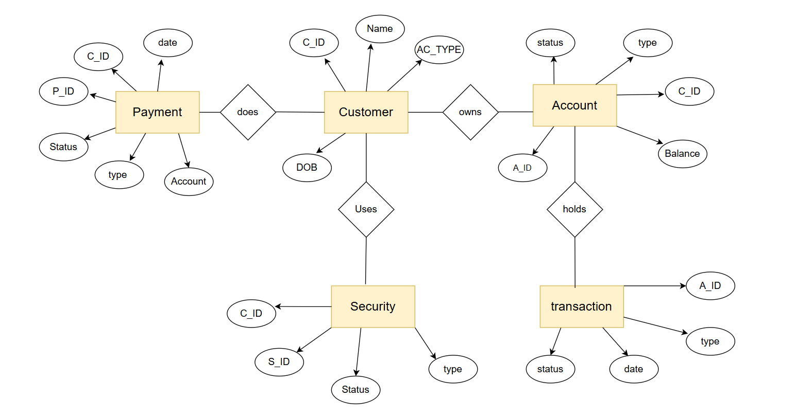

SRS for the payment managment system 

## Introduction

The Payment Management System (PMS) is designed to handle all aspects of payment processing, including transaction management, user account management, and reporting.

## System Requirements

### Functional Requirements
1. User Authentication and Authorization
    - Users must be able to register and log in.
    - Different roles (admin, user) with specific permissions.

2. Payment Processing
    - Users can add payment methods (credit card, bank account).
    - Users can make payments and view transaction history.

3. Transaction Management
    - The system should record all transactions.
    - Admins can view and manage all transactions.

4. Reporting
    - Generate reports on transactions, user activity, and system performance.

### Non-Functional Requirements
1. Performance
    - The system should handle up to 10 transactions per second.

2. Security
    - All sensitive data must be encrypted.
    - The system must comply with https standards.

3. Usability
    - The user interface should be intuitive and easy to use.

4. Scalability
    - The system should be able to scale to accommodate growing user base.

## Database Design

### Tables
1. **customer**
    - `Customer_id` (Primary Key)
    - `username`
    - `password`
    - `email`
    - `role`

2. **Payment**
    - `payment_method_id` (Primary Key)
    - `Customer_id` (Foreign Key)
    - `type` (e.g., credit card, bank account)
    - `details` (encrypted)

3. **Transactions**
    - `transaction_id` (Primary Key)
    - `Customer_id` (Foreign Key)
    - `amount`
    - `status`
    - `timestamp`

4. **Security**
    - `report_id` (Primary Key)
    - `type`
    - `content`
    - `generated_at`

5. **Account**
    - `Account_ID`(Primary key)
    - `Customer_ID`(Foreign  Key)
    - `Balance`
    - `Type`
    - `Status`

## ER Diagram 

## Conclusion

The Payment Management System aims to provide a secure, efficient, and user-friendly platform for managing payments and transactions. The system's design ensures scalability, performance, and compliance with industry standards.

## Future Aspects

-Enable Authentication